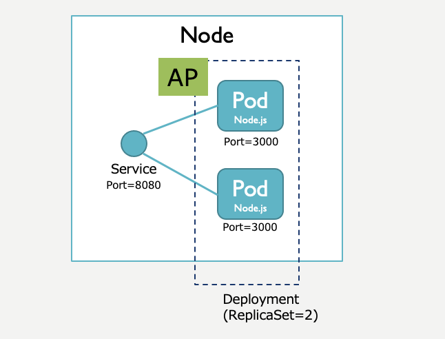

# k8s-web1

Web1階層サンプルです。<br>
GET要求に対して応答します。

* フロントエンド(AP)：Node.js



## インストール手順
(1)Dockerイメージ作成
```
$ make build
```

(2)Pod生成
```
$ make deploy
```

## アンインストール手順
```
$ make clean
```


## 動作確認用コマンド

```
$ curl localhost:8080
```
